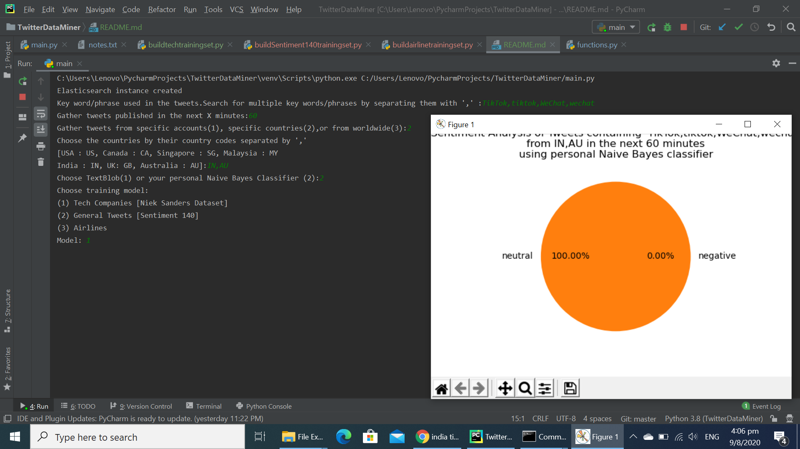
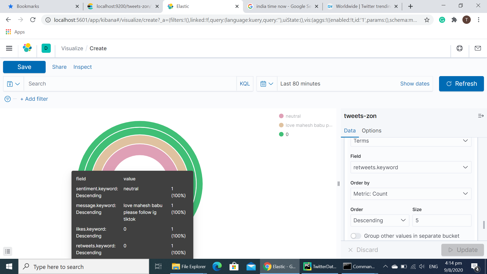
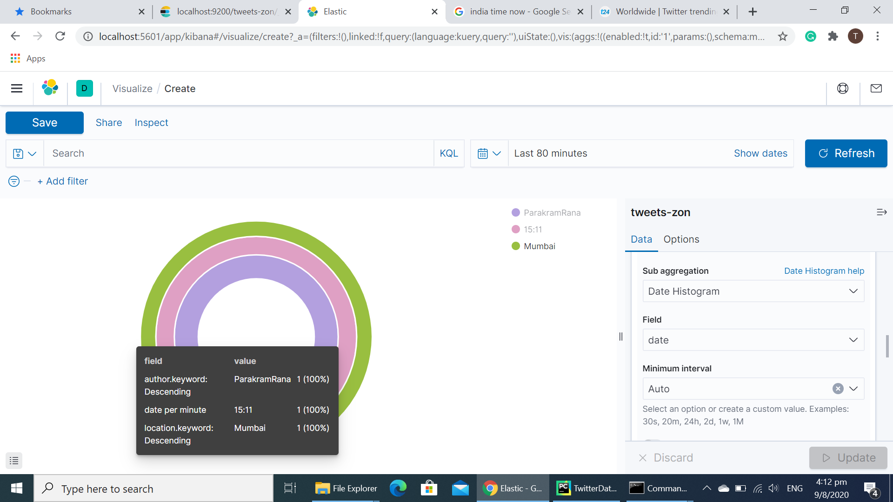
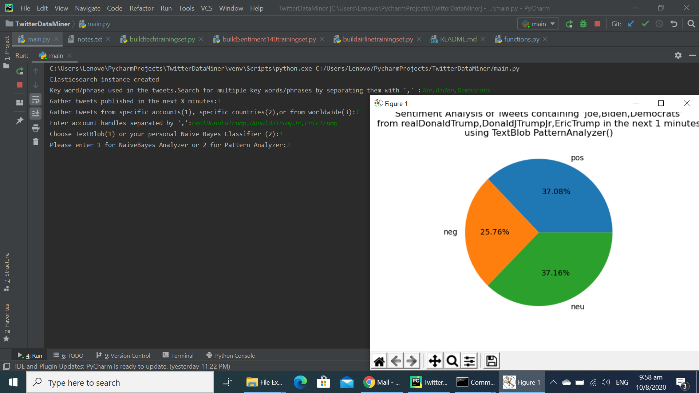
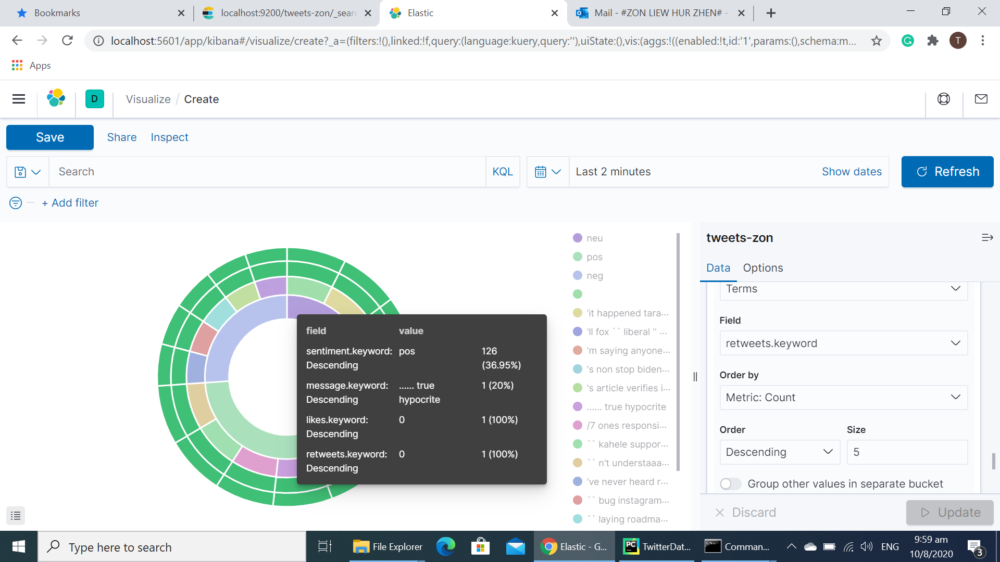
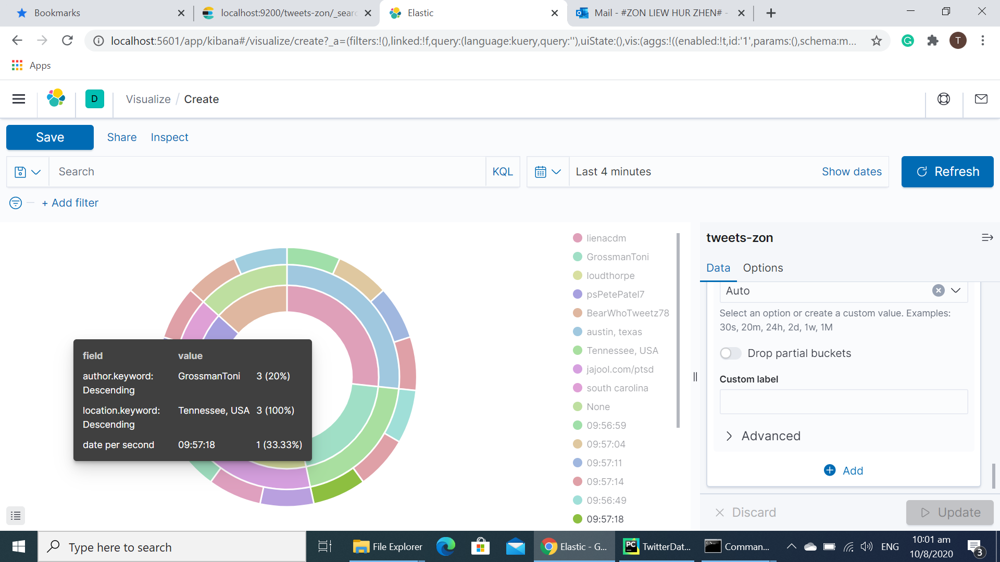

# Real-Time Twitter Sentiment Analysis Program

Allows users to obtain tweets containing chosen key words, gathered in a specified time period
(60 minutes > tweets published in the next 60 minutes). 

Users can further choose to filter results from specific accounts or countries (only works when using Twitter's Enterprise API), and analyze the overall sentiment 
of the tweets (positive/negative/neutral) gathered using a chosen classifier pre-trained on different models via
supervised learning.

Users can visualise the results as a pie chart

Users can also create Elasticsearch documents from the collected tweets for easy search/filtering, 
and visualise the results with additional details such as retweet/like number, tweet text, location
, author, and time of tweet using Kibana.

## Installation

This project was developed using PyCharm, and can be run by copy-pasting the code from Github into the IDE 
with the following packages installed:

- elasticsearch

- matplotlib

- nltk

- pandas

- python-twitter

- regex

- textblob

- tweepy

- XlsxWriter

## Usage
Instructions:

- Run all buildtrainingset files before release to users to build training sets and train the classifiers available, 
since this requires significant processing time. 

- Smallest data set is the data set with 4000 entries, and the largest is the Sentiment140 data set with a million 
entries, lowered from original 1.6 million due to limited Excel sheet size. Use the runtime for tech data set to 
estimate time needed too build Sentiment140 data set.

- Run main.py

Expected Output:
- Sentiments of tweets about Tiktok and WeChat from India/Australia in the next 60 minutes using personal
NaiveBayes Classifier trained on Tech Dataset:

1. Matplotlib Pie Chart

2. Kibana Pie Chart showing sentiment, top number of likes/retweets, and text of most retweeted tweets

3. Kibana Pie Chart showing location, author, and time of tweet

- Sentiments of tweets about Joe Biden and Democrats from the Donald Trump, Donald Trump Jr, and Eric Trump accounts 
in the next 9 hours using TextBlob's PatternAnalyzer:

1. Matplotlib Pie Chart

2. Kibana Pie Chart showing sentiment, top number of likes/retweets, and text of most retweeted tweets

3. Kibana Pie Chart showing location, author, and time of tweet

As seen in figure 3 here, tweets from other accounts were collected despite filtering with 
the account handles of DonaldTrump, Donald Trump Jr, and Eric Trump.

From Twitter API documentation:

For each user specified in follow parameter of stream.filter(), the stream will contain:

- Tweets created by the user.
- Tweets which are retweeted by the user.
- Replies to any Tweet created by the user.
- Retweets of any Tweet created by the user.
- Manual replies, created without pressing a reply button (e.g. “@twitterapi I agree”).

Like and retweet counts also seem to consistently be zero, indicating potential bug.
## Learning Outcomes
This self-initiated project is purely for interest and academic purposes. 

It has allowed me to practice my skills with:

- Python, and OOP practices such as the use of classes
- Manipulating JSON objects
- pandas
- matplotlib
- Managing complexity by separating code into files
- Github

I have also become familiar with the following while researching during development:
- Python superclasses
- twitter API and tweepy
- TextBlob
- Elasticsearch and Kibana
- Docker
- regex patterns
- Natural Language Processing with nltk package
- writing README files in Markdown, with reference to CommonMark syntax

## Possible Development
- Develop an online UI, either as a web page or phone application
- Allow developers to continue from where they left off if connection breaks when building/training classifiers
- Deliver program via Docker
- Increase the amount of classifiers available
- Allow user to gather tweets from more countries by having classifiers trained on other languages
- Store pre built training sets so future developers need not build them
- Improve runtime of buildtrainingset files
- Allow users to only collect tweets from chosen countries using locations param of stream.filter
- Allow users to collect past tweets
- Allow users to visualise tweets as they are collected in real time
- Fix incomplete account handle filter
- Guide to further full-stack development:
https://realpython.com/flask-by-example-part-1-project-setup/